# Nhật ký hội thoại với Antigravity — Mốc M0

## Câu hỏi 1
### 👤 User

Hướng dẫn cách làm ở bước B1

### 🤖 Agent

```text
Ran command: Get-ChildItem -Path .
Ran command: Get-ChildItem -Path .\LAB1 -Recurse
Viewed TH1-dung-moi-truong.md:1-137
Viewed cong-cu-mien-phi.md:1-60
Viewed README.md:1-52

```

Dưới đây là hướng dẫn chi tiết từng thao tác cho người chủ trì thực hiện **bước B1**:

---

#### 1. Ai làm bước này?

* **Chỉ 01 người duy nhất** trong nhóm (bạn phụ trách chủ trì mốc M0).
* 3 thành viên còn lại **chưa cần làm gì trên GitHub** lúc này, đợi bạn chủ trì tạo xong để được mời vào ở bước B2.

---

#### 2. Các bước thực hiện chi tiết

**Bước 1: Mở repo mẫu của môn**

* Đăng nhập vào tài khoản [GitHub](https://github.com?utm_source=gemini) của bạn.
* Mở đường link **repo mẫu** mà giảng viên đã cung cấp cho lớp.

**Bước 2: Chọn "Use this template"**

* Ở góc trên bên phải của trang repo mẫu (gần nút màu xanh lá `Code` hoặc cạnh nút `Fork`), bạn sẽ thấy nút:
👉 **`Use this template`**
* Bấm vào nút đó và chọn **`Create a new repository`**.

> *Lưu ý:* Tuyệt đối không bấm nút **Fork**, phải dùng **Use this template** để repo của nhóm là repo mới độc lập.

**Bước 3: Thiết lập thông tin repo mới**
Tại trang tạo repo mới, điền chính xác các mục sau:

1. **Owner**:
* Bấm vào ô dropdown chọn **Tổ chức (Organization) của môn học** (nơi giảng viên yêu cầu tạo), **không** để tài khoản cá nhân của bạn làm Owner.


2. **Repository name**:
* Đặt theo đúng quy định: `se100-nhom-XX` (thay `XX` bằng số nhóm của bạn, ví dụ: `se100-nhom-01`, `se100-nhom-05`,...).


3. **Description**:
* Có thể ghi tóm tắt tên đề tài hoặc để trống.


4. **Quyền riêng tư (Visibility)**:
* Chọn **`Public`** (Bắt buộc chọn Public để GitHub Actions chạy tự động không giới hạn số phút miễn phí).


5. **Include all branches**:
* Không cần tích (mặc định chỉ lấy nhánh chính `main`).


**Bước 4: Hoàn tất**

* Bấm nút màu xanh **`Create repository`** (hoặc `Create repository from template`).
* Đợi vài giây, GitHub sẽ tự động tạo repo mới với đầy đủ cây thư mục từ repo mẫu (`docs/`, `diagrams/`, `phan-tu/`, `scripts/`,...).

---

#### 3. Tiếp theo cần làm gì?

Ngay sau khi trang repo mới hiện ra, người chủ trì chuyển sang **bước B2**:

* Vào tab **Settings** của repo vừa tạo $\rightarrow$ chọn mục **Collaborators** ở cột bên trái $\rightarrow$ bấm **Add people** $\rightarrow$ gõ GitHub username của 3 bạn còn lại và mời với quyền **Write** (hoặc Admin).

---

---
## Câu hỏi 2
### 👤 User

repo mẫu đang được gửi đến dưới dạng 1 file .zip giải nén ra thành thư mục chứ ko có link, làm sao để dùng file giải nén đó làm template?

### 🤖 Agent

```text
Ran command: Get-ChildItem -Path .\LAB1\repo-mau -Force
Ran command: Get-ChildItem -Path .. -Recurse -Filter "*.zip" -ErrorAction SilentlyContinue
Ran command: Get-ChildItem -Path .\LAB1 -Recurse -Force | Where-Object { $_.Name -like "*github*" -or $_.Name -like "*workflow*" }
Ran command: Get-ChildItem -Path "$env:USERPROFILE\Downloads" -Filter "*repo*"
Ran command: Get-ChildItem -Path "$env:USERPROFILE\Downloads" -Filter "*.zip" | Select-Object -First 10 -Property Name, Length, LastWriteTime

```

Khi giảng viên gửi file `.zip` thay vì link GitHub template, bản chất của bước này là: **Tạo một repo trống trên GitHub rồi đẩy (push) toàn bộ nội dung đã giải nén lên đó làm khung ban đầu.**

Dưới đây là các bước thao tác chi tiết:

---

#### Bước 1: Tạo một repo mới TRỐNG trên GitHub

1. Mở GitHub, vào trang chủ hoặc vào **Tổ chức (Organization) của môn**.
2. Bấm nút **`New`** (màu xanh lá) để tạo repository mới:
* **Owner:** Chọn Organization của môn (hoặc tài khoản của bạn nếu chưa có Org).
* **Repository name:** Đặt tên `se100-nhom-XX` (với `XX` là số thứ tự nhóm).
* **Visibility:** Chọn **`Public`**.
* ⚠️ **RẤT QUAN TRỌNG:** **KHÔNG tích** vào bất kỳ ô nào trong phần *Initialize this repository with:*
* ❌ Không tích *Add a README file*
* ❌ Không tích *Add .gitignore*
* ❌ Không tích *Choose a license*
*(Phải để repo hoàn toàn trống thì mới đẩy thư mục mẫu lên được mà không bị lỗi xung đột)*.


3. Bấm **`Create repository`**.
4. GitHub sẽ hiện ra một trang hướng dẫn có sẵn đường link repo dạng:
`[https://github.com/](https://github.com/)<to-chuc>/se100-nhom-XX.git` $\rightarrow$ **Hãy sao chép (copy) đường link này**.

---

#### Bước 2: Dọn dẹp thư mục giải nén trên máy

1. Mở thư mục đã giải nén (ví dụ thư mục `repo-mau`).
2. Nếu thấy thư mục tên `__MACOSX`, hãy **xóa nó đi** (đây là tệp rác tự sinh khi nén từ máy Mac).
3. Đảm bảo các thư mục cốt lõi như `docs/`, `diagrams/`, `phan-tu/`, `scripts/`, `src/`, `README.md`, `AGENTS.md` đang nằm ngay bên trong thư mục này.

---

#### Bước 3: Đẩy toàn bộ thư mục mẫu lên GitHub bằng Git

Mở Terminal (VS Code Terminal, PowerShell hoặc Git Bash) **ngay tại thư mục giải nén đó** và chạy lần lượt các lệnh sau:

```bash
# 1. Khởi tạo Git trong thư mục mẫu với nhánh mặc định là main
git init -b main

# 2. Thêm tất cả file mẫu vào Git
git add .

# 3. Tạo commit đầu tiên
git commit -m "Initial commit from course template"

# 4. Liên kết với repo GitHub bạn vừa tạo ở Bước 1 (thay URL thật của nhóm bạn vào)
git remote add origin https://github.com/<to-chuc>/se100-nhom-XX.git

# 5. Đẩy toàn bộ lên GitHub
git push -u origin main

```

---

#### Bước 4: Kiểm tra và làm tiếp bước B2

1. Quay lại trang GitHub của repo `se100-nhom-XX`, tải lại trang (`F5`):
* Bạn sẽ thấy toàn bộ cây thư mục mẫu đã nằm ngay ngắn trên GitHub, hoàn toàn giống như kết quả khi bấm "Use this template".


2. Người chủ trì tiếp tục chuyển sang **bước B2**:
* Vào **Settings** $\rightarrow$ **Collaborators** $\rightarrow$ bấm **Add people** để thêm 3 thành viên còn lại với quyền **Write**.


3. Các thành viên còn lại bắt đầu từ **bước B3** (dùng `git clone` link repo này về máy từng người).

---

---
## Câu hỏi 3
### 👤 User

hướng dẫn làm bước D, deploy thành web trên cloudflare

### 🤖 Agent

Để gắn tên miền riêng (ví dụ: `tennhom.io.vn` hoặc `www.tennhom.io.vn`) vào trang web trên **Cloudflare Pages**, bạn thực hiện theo các bước sau:

---

#### Bước 1: Thêm Custom Domain trên Cloudflare Pages

1. Đăng nhập vào [Cloudflare Dashboard](https://dash.cloudflare.com/?utm_source=gemini).
2. Vào mục **Workers & Pages** $\rightarrow$ bấm chọn vào dự án của bạn (ví dụ `se100-nhom-11`).
3. Ở các tab menu bên trên, chọn tab **Custom domains**.
4. Bấm nút **Set up a custom domain**.
5. Nhập tên miền bạn muốn dùng (Ví dụ: `tennhom.io.vn` hoặc `web.tennhom.io.vn`).
6. Bấm **Continue**.

---

#### Bước 2: Cấu hình DNS trỏ về Cloudflare Pages

Lúc này, Cloudflare sẽ yêu cầu bạn trỏ bản ghi DNS từ nơi bạn mua tên miền về Cloudflare. Có 2 trường hợp phổ biến:

**Trường hợp A: Quản lý DNS trực tiếp tại nhà cung cấp (iNET, Mắt Bão, Tenten, PA Vietnam,...)** *(Cách dễ nhất)*

1. Đăng nhập vào trang quản lý dịch vụ nơi bạn đã mua tên miền `.io.vn`.
2. Vào mục **Quản lý tên miền** $\rightarrow$ chọn **Cấu hình / Quản lý DNS**.
3. Thêm một bản ghi (DNS Record) mới:
* **Loại (Type):** `CNAME`
* **Tên (Host / Name):** `@` *(hoặc để trống, hoặc điền `www` nếu bạn muốn dùng www.tennhom.io.vn)*
* **Giá trị (Target / Points to):** Điền link Pages của bạn, dạng:
`se100-nhom-11.pages.dev`
* **TTL:** Giữ mặc định (hoặc 300 / 1800).


4. Lưu bản ghi lại.

> *Lưu ý:* Một số nhà cung cấp không cho tạo CNAME ở bản ghi `@` (root domain). Nếu gặp trường hợp này, bạn có thể tạo subdomain như `www` hoặc `web` với giá trị trỏ về `se100-nhom-11.pages.dev`.

**Trường hợp B: Đã chuyển NameServer (NS) của tên miền về Cloudflare**
Nếu bạn đã add cả tên miền đó vào Cloudflare DNS:

* Cloudflare Pages sẽ nhận diện được ngay và hiện nút **Add CNAME record**.
* Bạn chỉ cần bấm đồng ý, Cloudflare sẽ tự động tạo bản ghi DNS cho bạn mà không cần gõ thủ công.

---

#### Bước 3: Đợi kích hoạt SSL (HTTPS)

1. Quay lại trang Cloudflare Pages, bạn sẽ thấy trạng thái của tên miền:
* Ban đầu là: `Initializing` hoặc `Pending verification`.
* Thường mất khoảng **2 đến 15 phút** (tối đa vài giờ tùy tốc độ cập nhật DNS của nhà cung cấp).


2. Khi trạng thái chuyển sang màu xanh **Active**, Cloudflare đã tự động cấp chứng chỉ SSL (HTTPS) miễn phí.
3. Lúc này bạn có thể gõ `[https://tennhom.io.vn](https://tennhom.io.vn)` trên trình duyệt máy tính hoặc điện thoại để vào web.

---

#### Bước 4: Cập nhật lại đồ án (Bước D3, D4)

* Dùng điện thoại truy cập vào địa chỉ tên miền mới: `[https://tennhom.io.vn](https://tennhom.io.vn)`.
* Chụp ảnh màn hình điện thoại lưu vào `docs/deploy.md`.
* Mở [README.md], cập nhật lại dòng:
```markdown
## URL

- Bản chạy: https://tennhom.io.vn
- Pipeline: xem tab Actions

```


* Commit và push lên GitHub để hoàn tất.

---

---
## Câu hỏi 4
### 👤 User

cách setup custom domain trên cloudflare, kết nối với .id.vn trên inet

### 🤖 Agent

Để kết nối tên miền `.id.vn` mua trên **iNET** với **Cloudflare Pages**, cách chuẩn và mượt nhất là **Chuyển NameServer (NS) từ iNET sang Cloudflare**.

> **Tại sao nên dùng cách này?**
> Mặc định hệ thống DNS của iNET không cho phép tạo bản ghi `CNAME` cho tên miền gốc (`@` hay `tenmien.id.vn`). Khi chuyển NameServer về Cloudflare quản lý, Cloudflare sẽ tự động xử lý và cấp chứng chỉ HTTPS (SSL) xanh mượt chỉ sau vài phút.

Dưới đây là các bước thao tác chi tiết:

---

#### PHẦN 1: Thêm tên miền vào Cloudflare để lấy NameServer

1. Đăng nhập vào [dash.cloudflare.com](https://dash.cloudflare.com/?utm_source=gemini).
2. Ở thanh menu bên trái, chọn **Websites** $\rightarrow$ Bấm nút **Add a domain** (hoặc **Add a site**).
3. Nhập tên miền của bạn (ví dụ: `tenmien.id.vn`) $\rightarrow$ Bấm **Continue**.
4. Kéo xuống dưới cùng chọn gói **Free ($0)** $\rightarrow$ Bấm **Continue**.
5. Cloudflare sẽ quét các bản ghi DNS có sẵn, bạn cứ bấm **Continue** để tiếp tục.
6. Màn hình sẽ hiện mục **Change your nameservers**. Cloudflare sẽ cấp cho bạn **2 địa chỉ NameServer**, có dạng:
* `xxxx.ns.cloudflare.com`
* `yyyy.ns.cloudflare.com`
*(Hãy giữ nguyên trang này hoặc copy 2 dòng đó)*.


---

#### PHẦN 2: Đổi NameServer trên iNET

1. Đăng nhập vào tài khoản trên [inet.vn](https://inet.vn?utm_source=gemini).
2. Vào **Danh sách dịch vụ** $\rightarrow$ chọn mục **Tên miền**.
3. Bấm vào nút **Quản lý** (hoặc click trực tiếp vào tên miền `.io.vn` của bạn).
4. Ở menu bên trái hoặc phía trên, tìm mục **Thay đổi NameServer** (hoặc *Cập nhật DNS*).
5. Tích chọn **Tự nhập NameServer** (DNS bên ngoài):
* **NameServer 1:** Dán địa chỉ 1 của Cloudflare vào (ví dụ `xxxx.ns.cloudflare.com`)
* **NameServer 2:** Dán địa chỉ 2 của Cloudflare vào (ví dụ `yyyy.ns.cloudflare.com`)
*(Nếu có NameServer 3, 4 thì xóa đi)*.


6. Bấm nút **Lưu / Cập nhật**.

---

#### PHẦN 3: Gắn tên miền vào Cloudflare Pages

1. Quay lại trang Cloudflare Dashboard $\rightarrow$ chọn mục **Workers & Pages**.
2. Bấm chọn vào dự án web của nhóm bạn (ví dụ: `se100-nhom-11`).
3. Chuyển sang tab **Custom domains** $\rightarrow$ Bấm nút **Set up a custom domain**.
4. Nhập tên miền của bạn:
* Nhập tên miền chính: `tenmien.id.vn`
* *(Nếu muốn cả bản `www.tenmien.id.vn` thì sau khi xong tên miền chính, bạn lặp lại bước này thêm `www`)*.


5. Bấm **Continue**.
6. Do tên miền đã được thêm vào Cloudflare ở Phần 1, Cloudflare sẽ tự nhận diện và hiện nút xác nhận bản ghi $\rightarrow$ Bạn chỉ cần bấm **Activate domain**.

---

#### PHẦN 4: Kiểm tra kết quả

* Quá trình đồng bộ DNS giữa iNET và Cloudflare thường mất từ **5 đến 15 phút** (chậm nhất là 1–2 giờ).
* Khi trạng thái của tên miền trong Cloudflare Pages đổi từ `Pending / Initializing` sang màu xanh lá **`Active`**:
* Mở trình duyệt trên máy tính hoặc điện thoại truy cập thử: `[https://tenmien.id.vn](https://tenmien.id.vn)`.
* Trang web sẽ hiển thị có sẵn biểu tượng ổ khóa bảo mật (HTTPS).


* Sau đó chụp màn hình điện thoại cập nhật vào `docs/deploy.md` và đổi URL trong [README.md] như yêu cầu của bài TH1.

---

---
## Câu hỏi 5
### 👤 User

tab checks hiện tại chỉ có 1 check là của cloudflare workers and pages thôi chứ không có thêm gì khác, có vẻ như nó không chạy checks tự động được thiết lập trong kiem_moc.py, kiểm tra lại xem

### 🤖 Agent

```text
Ran command: Test-Path .\LAB1\repo-mau\.github; Get-ChildItem -Path . -Recurse -Force -Filter "*.yml" -ErrorAction SilentlyContinue
Ran command: Get-ChildItem -Path "$env:USERPROFILE\Downloads", "$env:USERPROFILE\Desktop" -Recurse -Force -Filter "*kiem*moc*" -ErrorAction SilentlyContinue
Viewed kiem_moc.py:290-334
Ran command: Get-ChildItem -Path C:\Users\Acer\ -Filter "*repo*mau*" -Recurse -Force -ErrorAction SilentlyContinue
Killed task Search for repo-mau files across user directory
Ran command: Get-ChildItem -Path .\LAB1\repo-mau\__MACOSX -Force -Recurse
Ran command: Select-String -Path .\* -Pattern "github.com" -ErrorAction SilentlyContinue; Select-String -Path .\LAB1\* -Pattern "github.com" -ErrorAction SilentlyContinue
Used tool: search_web

```

Lý do tab Checks hiện tại chỉ có Cloudflare Pages mà không có **"Kiểm mốc"** là: **Repo trên GitHub đang bị thiếu thư mục `.github/workflows/`!**

#### Nguyên nhân:

* GitHub Actions **bắt buộc** phải có file `.github/workflows/*.yml` thì mới biết cần chạy kiểm tra cái gì.
* Trong file `README.md` của môn có ghi cấu trúc:
```text
.github/      workflow kiểm mốc — đừng sửa

```


* Tuy nhiên, vì bạn nhận repo dưới dạng file `.zip`, thư mục bắt đầu bằng dấu chấm (`.github`) là **thư mục ẩn** trên hệ điều hành, nên khi nén/giải nén hoặc copy lên GitHub nó đã bị sót.

---

#### Cách khắc phục (Tạo lại file workflow `kiem-moc.yml`):

Tập lệnh `scripts/kiem_moc.py` đã có sẵn, ta chỉ cần tạo 1 file cấu hình để GitHub Actions gọi nó mỗi khi mở Pull Request.

**Bước 1: Tạo thư mục và file workflow**
Trong thư mục repo của bạn:

1. Tạo thư mục: `.github` $\rightarrow$ bên trong tạo tiếp thư mục: `workflows`.
2. Tạo một file tên là: **`kiem-moc.yml`** nằm tại đường dẫn:
`.github/workflows/kiem-moc.yml`

**Bước 2: Dán nội dung sau vào `kiem-moc.yml**`

```yaml
name: Kiểm mốc

on:
  pull_request:
    branches: [ main ]
  push:
    branches: [ main ]

jobs:
  kiem-moc:
    name: Kiểm mốc
    runs-on: ubuntu-latest
    steps:
      - name: Checkout code
        uses: actions/checkout@v4
        with:
          fetch-depth: 0

      - name: Cài đặt Python
        uses: actions/setup-python@v5
        with:
          python-version: '3.11'

      - name: Chạy script kiểm mốc
        run: python scripts/kiem_moc.py

```

> **Giải thích cấu hình:**
> * `fetch-depth: 0`: Bắt buộc để tải toàn bộ lịch sử commit, giúp script đếm đủ 4 email của 4 thành viên.
> * `python scripts/kiem_moc.py`: Script sẽ tự động đọc nhánh `moc/M0` từ PR và chạy đúng bộ kiểm tra cho mốc M0.
> 
> 

---

**Bước 3: Commit và Push lên nhánh `moc/M0**`

Mở terminal tại thư mục repo và chạy:

```bash
git checkout moc/M0
git add .github/workflows/kiem-moc.yml
git commit -m "Them workflow Kiem moc vao GitHub Actions"
git push origin moc/M0

```

---

#### Kết quả:

Ngay sau khi push xong:

1. Bạn quay lại trang **Pull Request** trên GitHub $\rightarrow$ mở tab **Checks**.
2. Bạn sẽ thấy ngay mục **Kiểm mốc** xuất hiện và đang quay tròn để chạy.
3. Chờ vài chục giây, nó sẽ in ra danh sách các tiêu chí ✅ và ❌ để nhóm bạn biết cần hoàn thiện những gì tiếp theo!

---

---
## Câu hỏi 6
### 👤 User

khi các thành viên khác đóng góp, họ cùng thực hiện đồng thời trên branch moc/M0 này luôn đúng không? nếu thế thì làm sao tránh khỏi conflict hoặc có nguy cơ hỏng branch?

### 🤖 Agent

Câu hỏi của bạn rất hay và chạm đúng vào bản chất của làm việc nhóm với Git!

Có **2 cách tiếp cận** mà các nhóm thường dùng, từ cách đơn giản cho đồ án môn học đến quy trình chuẩn trong doanh nghiệp:

---

#### Cách 1: Cùng làm việc trên nhánh `moc/M0` (Cách thầy hướng dẫn trong bài LAB)

Vì mốc M0 các phần việc được chia theo **các file hoàn toàn độc lập**:

* Bạn 1: Viết 3 câu hỏi trong `docs/cau-hoi-khach-hang.md`
* Bạn 2: Viết bản phản tư trong `phan-tu/M0.md`
* Bạn 3: Viết nhật ký AI trong `ai-log/M0-*.md`
* Bạn 4: Bổ sung 5 dòng mô tả trong `README.md`

> 💡 **Quy tắc vàng: Nếu mỗi người sửa một FILE KHÁC NHAU, Git sẽ tự động gộp (auto-merge) 100% êm đẹp, không bao giờ bị conflict.**

**Thao tác an toàn cho từng người khi cùng làm trên `moc/M0`:**
Mỗi thành viên trước khi bắt đầu làm hoặc trước khi push lên GitHub hãy tuân thủ 4 bước này:

```bash
# 1. Trước khi làm: Lấy code mới nhất về máy
git checkout moc/M0
git pull --rebase origin moc/M0

# 2. Làm bài, sửa file của mình...

# 3. Khi làm xong, commit vào máy
git add <ten-file-minh-sua>
git commit -m "M0: Mo ta viec minh vua lam"

# 4. Tránh xung đột trước khi đẩy lên GitHub:
git pull --rebase origin moc/M0
git push origin moc/M0

```

> Lệnh `git pull --rebase` có tác dụng: Xếp commit của bạn lên trên cùng lịch sử một cách thẳng hàng, tránh tạo ra các commit merge rác (`Merge branch...`) làm bẩn lịch sử repo.

---

#### Cách 2: Tạo nhánh con (Feature Branch) — Chuẩn công nghiệp ⭐

Nếu nhóm muốn **an toàn tuyệt đối**, không ai có thể làm hỏng nhánh `moc/M0` của nhau:

1. **Từ nhánh `moc/M0`, mỗi người tách ra một nhánh con riêng của mình:**
```bash
git checkout moc/M0
git pull origin moc/M0
git checkout -b feat/m0-cau-hoi-khach-hang   # Tên nhánh của bạn

```


2. **Làm xong, đẩy nhánh con lên GitHub:**
```bash
git add .
git commit -m "Them 3 cau hoi khach hang"
git push -u origin feat/m0-cau-hoi-khach-hang

```


3. **Mở Pull Request vào `moc/M0`:**
* Lên GitHub mở PR: **`base: moc/M0` $\leftarrow$ `compare: feat/m0-cau-hoi-khach-hang**`.
* Bạn chủ trì mốc M0 xem qua thấy ổn thì bấm **Merge**.
* Khi nhánh `moc/M0` được gộp thêm file mới, Pull Request chính (`moc/M0` $\rightarrow$ `main`) sẽ tự động kích hoạt workflow kiểm mốc chạy lại.


---

#### Nếu lỡ bị Conflict (Xung đột) thì sao?

Đừng lo, **trong Git không bao giờ sợ mất code** vì mọi commit đều được lưu theo mã hash.

* Nếu hai người cùng sửa **cùng 1 dòng** trong file `README.md`, Git sẽ dừng lại và đánh dấu:
```text
<<<<<<< HEAD (code của bạn trên GitHub)
...
=======
... (code của bạn dưới máy)
>>>>>>> commit-hash

```


* **Cách xử lý rất nhanh trong VS Code:**
* VS Code sẽ tự hiện các nút bấm: *Accept Current Change*, *Accept Incoming Change*, hoặc **Accept Both Changes** (Giữ cả hai).
* Bạn chỉ cần bấm chọn giữ nội dung đúng, lưu file lại.
* Chạy:
```bash
git add .
git rebase --continue   # (hoặc git commit neu dang merge thuong)
git push origin moc/M0

```


---

---
## Câu hỏi 7
### 👤 User

giảng viên có yêu cầu file ai-log, muốn export conversation theo định dạng yêu cầu thì phải làm sao?
bảng phản tư yêu cầu ghi những gì?

### 🤖 Agent

```text
Viewed README.md:1-8
Ran command: Get-ChildItem -Path C:\Users\Acer\ -Filter "*mau-ban-phan-tu*" -Recurse -Force -ErrorAction SilentlyContinue
Used tool: manage_task
Ran command: Get-ChildItem -Path "..\*mau-ban-phan-tu*" -Recurse
Viewed c:\Users\Acer\Desktop\Ky_5\SE100_PTPMHDH\Hu?ng d?n d? n-20260926\mau-ban-phan-tu.md:2-101
Ran command: (Get-ChildItem -Path "..\*mau-ban-phan-tu.md" -Recurse).FullName
Ran command: Get-Content -Path (Get-ChildItem -Path "..\*mau-ban-phan-tu.md" -Recurse).FullName -Raw -Encoding utf8

```

Dưới đây là câu trả lời chi tiết và mẫu chuẩn theo đúng tài liệu gốc của môn học cho cả 2 phần:

---

#### PHẦN 1: File `ai-log` (Cách xuất và định dạng)

**1. Quy định của môn về `ai-log`:**

* **Tên file:** Phải chứa mã mốc trong tên, ví dụ: `ai-log/M0-antigravity.md` hoặc `ai-log/M0-chat.md`.
* **Định dạng:** Định dạng Markdown (`.md`) hoặc Text (`.txt`).
* **CI kiểm tra:** Hệ thống CI chỉ kiểm tra trong thư mục `ai-log/` **có tồn tại file chứa chữ `M0` hay không**, không chấm nội dung. Thầy cô đọc lướt qua để xem nhóm trao đổi với AI ra sao.

**2. Cách export hội thoại từ Antigravity:**

* **Cách nhanh & chuẩn nhất:**
1. Trong khung chat này, bạn quét chuột chọn các đoạn trao đổi then chốt (hoặc bấm biểu tượng copy câu trả lời).
2. Tạo file `ai-log/M0-antigravity.md` trong repo.
3. Dán nội dung vào. Bạn có thể định dạng đơn giản như sau:
```markdown
# Nhật ký hội thoại với Antigravity — Mốc M0

**User:** Làm sao để deploy web lên Cloudflare Pages?
**AI:** ...

**User:** Sơ đồ Mermaid bị lỗi unable to render rich display trên GitHub...
**AI:** ...

```


* *(Ngoài ra, nếu muốn lấy file nhật ký gốc tự động của Antigravity, hệ thống lưu sẵn tại máy bạn ở đường dẫn: `C:\Users\Acer\.gemini\antigravity\brain\b8de71e1-890b-41b2-8d88-933ce70e3891\.system_generated\logs\transcript.jsonl`)*.

---

#### PHẦN 2: Bản phản tư (`phan-tu/M0.md`) yêu cầu ghi những gì?

File phải được đặt tại: `phan-tu/M0.md`.

**⚠️ Điều kiện bắt buộc để CI chấm ĐẠT:**

1. Độ dài: **Từ 40 từ trở lên** (ở mốc M0 chỉ cần $\ge 40$ từ, các mốc M1–M5 sau này cần $\ge 120$ từ).
2. **Bắt buộc có ít nhất 1 mã commit hash (7 ký tự hex)** trỏ tới một commit thực tế trong repo của bạn (ví dụ: `7f3a1b2`). *Không có hash commit thì CI sẽ đánh trượt*.

---

**📝 Cấu trúc 4 mục bắt buộc (Theo file mẫu của môn):**

Bạn có thể tạo file `phan-tu/M0.md` và điền theo mẫu sau:

```markdown
# Bản phản tư mốc M0 — Nhóm 11

## 1. Agent đã đề xuất gì?
- Đề xuất cấu hình Cloudflare Pages với Build output directory là `src`.
- Hướng dẫn cấu hình trỏ NameServer và CNAME cho tên miền `.id.vn` từ iNET sang Cloudflare.
- Đề xuất tạo lại workflow `.github/workflows/kiem-moc.yml` để chạy GitHub Actions.

## 2. Nhóm đã sửa chỗ nào, và vì sao?
- Nhóm chủ động sửa lại file cấu hình `kiem-moc.yml` và dọn dẹp các ghi chú trong sơ đồ Mermaid để GitHub render được, tránh lỗi "Unable to render rich display".
- Mã commit: `a1b2c3d` *(thay bằng mã hash commit 7 ký tự thật của nhóm bạn)*

## 3. Chỗ nào nhóm chấp nhận đề xuất của agent dù thấy chưa ổn?
- Nhóm chấp nhận dùng cấu trúc HTML tĩnh tối giản trong `src/index.html` theo đề xuất của agent để kịp giờ kiểm tra trên lớp, dù giao diện thực tế chưa có tính năng nào của hệ thống.
- Mã commit: `e4f5g6h` *(thay bằng mã hash commit thật)*

## 4. Một điều nhóm học được ở mốc này mà tuần trước chưa biết
- Nhóm hiểu được cách hoạt động của NameServer khi liên kết giữa nhà đăng ký iNET với Cloudflare và cách thiết lập GitHub Actions tự động kiểm tra mốc nộp bài qua Pull Request.

---
**Ai viết bản này:** [Tên người viết]  
**Ai đã đọc và đồng ý:** [Tên 1], [Tên 2], [Tên 3]

```

> 💡 **Cách lấy mã commit hash 7 ký tự:**
> Mở terminal gõ lệnh: `git log --oneline -n 3` $\rightarrow$ copy 7 ký tự đầu tiên của commit gần nhất (ví dụ: `c8d9e1f`) rồi dán vào mục 2 và 3 trong file phản tư.

---

---
## Câu hỏi 8
### 👤 User
  Từ infor để tài quản lý đội tuyển thi đấu và user story. Dưới quy mô một đồ án môn học phải làm trong 11-12 tuần, kiểm tra xem user story đã đủ để cover nhu cầu của khách hàng ảo chưa, có thể thêm hoặc loại use case nếu cần.
  Quản lý đội tuyển thi đấu. Cơ bản gồm thành viên, huấn luyện viên, thủ quỹ. Flow gợi ý là tuyển -> thử -> chính thức -> Thi đấu. Trong đó có ràng buộc chi không vượt quỹ
  Use case/ User story:
  là [ai], tôi muốn [làm gì], để [được gì]
Là thành viên chính thức, tôi muốn theo dõi lịch biểu của đội, để sắp xếp thời gian cá nhân
Là ứng cử viên, tôi muốn nộp hồ sơ ứng tuyển, để tham gia quy trình gia nhập đội
Là thủ quỹ, tôi muốn nhắc các thành viên đóng quỹ, để quỹ đội đầy đủ trong tháng
Là thủ quỹ, tôi muốn theo dõi lịch sử thu chi quỹ đội, để kiểm tra và quản lý dòng tiền
Là huấn luyện viên, tôi muốn lên kế hoạch cho lịch biểu tuần tới của đội, để các thành viên chủ động sắp xếp thời gian
Là một huấn luyện viên, tôi muốn có danh sách các tuyển thủ để có thông tin liên lạc của tuyển thủ
Là thành viên chính thức, tôi muốn thanh toán nhanh qua qr, để đóng quỹ một cách thuận tiện.
Là huấn luyện viên, tôi muốn thông báo tuyển người, để tìm ứng cử viên tiềm năng
Là huấn luyện viên, tôi muốn bảng thống kê, để đánh giá hiệu suất thành viên.

### 🤖 Agent
Các use case cũ đều đúng đề tài, không cái nào phải loại. Vấn đề là **thiếu use case cho chính flow và ràng buộc mà đề tài nêu**: cả 9 story hiện tại chỉ có "nộp hồ sơ" và "đăng tin" thuộc giai đoạn tuyển, còn thử, chính thức, thi đấu và chi quỹ gần như trống. Các thao tác chuyển giai đoạn không có story nên diagram trước đó phải bù bằng kế thừa và enum thừa.

#### Danh sách use case đề xuất

| # | Story | Giai đoạn | Nguồn | Mức |
|---|---|---|---|---|
| 1 | Là huấn luyện viên, tôi muốn đăng thông báo tuyển người, để tìm ứng cử viên tiềm năng | Tuyển | Giữ | Cốt lõi |
| 2 | Là ứng cử viên, tôi muốn nộp hồ sơ ứng tuyển và tra cứu kết quả, để tham gia quy trình gia nhập đội | Tuyển | Giữ, gộp thêm tra cứu kết quả | Cốt lõi |
| 3 | Là huấn luyện viên, tôi muốn xét duyệt hồ sơ và mời vào thử việc, để chọn người phù hợp | Tuyển → Thử | **Thêm** | Cốt lõi |
| 4 | Là huấn luyện viên, tôi muốn đánh giá thành viên thử việc và quyết định cho lên chính thức hoặc loại, để đội chỉ giữ người đạt yêu cầu | Thử → Chính thức | **Thêm** | Cốt lõi |
| 5 | Là huấn luyện viên, tôi muốn lên lịch biểu tuần tới của đội, để các thành viên chủ động sắp xếp thời gian | Vận hành | Giữ, thêm kiểm tra trùng lịch | Cốt lõi |
| 6 | Là thành viên (thử việc hoặc chính thức), tôi muốn theo dõi lịch biểu của đội, để sắp xếp thời gian cá nhân | Vận hành | Giữ, bỏ chữ "chính thức" vì người thử việc cũng phải đi tập | Cốt lõi |
| 7 | Là huấn luyện viên, tôi muốn điểm danh buổi tập và buổi thi đấu, để có dữ liệu chuyên cần | Vận hành | **Thêm** | Nên có |
| 8 | Là huấn luyện viên và thủ quỹ, chúng tôi muốn xem danh sách thành viên kèm thông tin liên lạc, để liên hệ khi cần | Vận hành | Giữ, đổi "tuyển thủ" thành "thành viên" cho thống nhất | Nên có |
| 9 | Là huấn luyện viên, tôi muốn lập đội hình và ghi kết quả từng trận, để tổ chức thi đấu và lưu dữ liệu đánh giá | Chính thức → Thi đấu | **Thêm** | Cốt lõi |
| 10 | Là huấn luyện viên, tôi muốn xem bảng thống kê chuyên cần và thi đấu của từng thành viên, để đánh giá hiệu suất | Thi đấu | Giữ, xác định rõ dữ liệu nguồn | Cốt lõi |
| 11 | Là thủ quỹ, tôi muốn tạo khoản đóng quỹ theo tháng và nhắc thành viên chưa đóng, để quỹ đội đầy đủ trong tháng | Quỹ | Giữ, gộp "tạo khoản" vào "nhắc" | Cốt lõi |
| 12 | Là thành viên chính thức, tôi muốn thanh toán nhanh qua QR, để đóng quỹ thuận tiện | Quỹ | Giữ, chỉ mô phỏng | Cốt lõi |
| 13 | Là thủ quỹ, tôi muốn xác nhận khoản đã đóng, để cập nhật đúng số dư quỹ | Quỹ | **Thêm** | Nên có |
| 14 | Là thủ quỹ, tôi muốn ghi nhận khoản chi và bị hệ thống từ chối nếu vượt số dư quỹ, để bảo đảm chi không vượt quỹ | Quỹ | **Thêm**, đây là ràng buộc trung tâm của đề tài | Cốt lõi |
| 15 | Là thủ quỹ, tôi muốn theo dõi lịch sử thu chi của quỹ, để kiểm tra và quản lý dòng tiền | Quỹ | Giữ | Cốt lõi |

- **Gộp:** story "danh sách tuyển thủ" vào #8, "nhắc đóng quỹ" vào #11, "tra cứu kết quả" vào #2.
- **Thêm:** #3, #4, #7, #9, #13, #14. Trong đó #3, #4, #9 là ba bước chuyển giai đoạn của flow, #14 là ràng buộc của đề tài.
- **Nếu cần cắt phạm vi:** #7 (đổi thành một cột chuyên cần đơn giản) và #13 (QR mô phỏng tự chuyển sang "chờ xác nhận", thủ quỹ bấm xác nhận).
- **Giả định nên ghi vào báo cáo:** chỉ thành viên chính thức phải đóng quỹ; thủ quỹ và huấn luyện viên không đóng.


---

---
## Câu hỏi 9
### 👤 User

hoàn thiện mã mermaid mà tôi có thể copy
### 🤖 Agent


```mermaid
classDiagram
    direction TB

    class DoiTuyen {
        +String maDoi
        +String tenDoi
        +String boMon
        +thongKeCaNhan(tv: ThanhVien) ThongKeCaNhan
    }

    class ThanhVien {
        +String maTV
        +String hoTen
        +String sdt
        +String email
        +VaiTro vaiTro
        +TrangThaiTV trangThai
        +String viTriThiDau
        +int soAo
        +Date ngayVaoDoi
        +capNhatLienLac(sdt: String, email: String) void
        +chuyenTrangThai(moi: TrangThaiTV) void
        +xemLichBieu() List~LichBieu~
    }

    class TinTuyenDung {
        +String maTin
        +String tieuDe
        +String yeuCau
        +int soLuongCan
        +Date hanNop
        +bool dangMo
        +dangTin() void
        +dongTin() void
    }

    class HoSoUngTuyen {
        +String maHoSo
        +String hoTen
        +String sdt
        +String email
        +String hoSoUrl
        +DateTime ngayNop
        +TrangThaiHoSo trangThai
        +String nhanXet
        +moiThu(hlv: ThanhVien) ThanhVien
        +tuChoi(lyDo: String) void
        +rutHoSo() void
    }

    class DanhGiaThuViec {
        +String maDG
        +Date ngayDanhGia
        +float diemChuyenMon
        +String nhanXet
        +KetQuaThuViec ketQua
        +chotKetQua() void
    }

    class LichBieu {
        +String maLich
        +String tieuDe
        +LoaiLich loai
        +DateTime batDau
        +DateTime ketThuc
        +String diaDiem
        +kiemTraTrung() bool
        +guiThongBao() void
    }

    class DiemDanh {
        +bool coMat
        +String lyDoVang
    }

    class TranDau {
        +String maTran
        +String tenGiai
        +String doiThu
        +KetQuaTran ketQua
        +String tySo
        +chotDoiHinh(ds: List~ThanhVien~) void
        +ghiKetQua(kq: KetQuaTran, tySo: String) void
    }

    class ThamGiaTranDau {
        +String viTri
        +int phutThiDau
        +float diemDanhGia
        +String nhanXet
    }

    class ThongKeCaNhan {
        <<computed>>
        +float tyLeChuyenCan
        +int soTranThamGia
        +float tyLeThang
        +float diemDanhGiaTB
    }

    class Quy {
        +String maQuy
        +Decimal soDu
        +String taiKhoanNhan
        +kiemTraKhaNangChi(soTien: Decimal) bool
        +ghiThu(gd: GiaoDich) void
        +ghiChi(gd: GiaoDich) bool
        +taoKhoanDongThang(ky: String, soTien: Decimal) List~KhoanDongQuy~
        +nhacThanhVienChuaDong(ky: String) int
    }

    class KhoanDongQuy {
        +String maKhoan
        +String ky
        +Decimal soTien
        +Date hanDong
        +TrangThaiKhoan trangThai
        +taoMaQR() String
        +danhDauDaDong(gd: GiaoDich) void
    }

    class GiaoDich {
        +String maGD
        +LoaiGD loai
        +String hangMuc
        +Decimal soTien
        +DateTime thoiGian
        +TrangThaiGD trangThai
        +String ghiChu
    }

    class ThongBao {
        +String maTB
        +LoaiThongBao loai
        +String noiDung
        +DateTime thoiGian
        +bool daDoc
    }

    class VaiTro {
        <<enumeration>>
        TUYEN_THU
        HUAN_LUYEN_VIEN
        THU_QUY
    }

    class TrangThaiTV {
        <<enumeration>>
        THU
        CHINH_THUC
        DA_LOAI
        ROI_DOI
    }

    class TrangThaiHoSo {
        <<enumeration>>
        DA_NOP
        DANG_XET
        MOI_THU
        TU_CHOI
        DA_RUT
    }

    class KetQuaThuViec {
        <<enumeration>>
        DAT
        KHONG_DAT
    }

    class LoaiLich {
        <<enumeration>>
        TAP
        HOP
        THI_DAU
    }

    class KetQuaTran {
        <<enumeration>>
        THANG
        HOA
        THUA
    }

    class LoaiGD {
        <<enumeration>>
        THU
        CHI
    }

    class TrangThaiGD {
        <<enumeration>>
        CHO_XAC_NHAN
        HOAN_TAT
        TU_CHOI
    }

    class TrangThaiKhoan {
        <<enumeration>>
        CHUA_DONG
        CHO_XAC_NHAN
        DA_DONG
        QUA_HAN
    }

    class LoaiThongBao {
        <<enumeration>>
        NHAC_QUY
        LICH_MOI
        KET_QUA_HO_SO
    }

    %% Doi tuyen la goc so huu
    DoiTuyen "1" *-- "0..*" ThanhVien : gom
    DoiTuyen "1" *-- "1" Quy : coQuy
    DoiTuyen "1" *-- "0..*" TinTuyenDung : dang
    DoiTuyen "1" *-- "0..*" LichBieu : lap
    DoiTuyen "1" *-- "0..*" TranDau : thamGia
    DoiTuyen ..> ThongKeCaNhan : tinh

    %% Flow: Tuyen -> Thu -> Chinh thuc
    TinTuyenDung "1" *-- "0..*" HoSoUngTuyen : nhan
    HoSoUngTuyen "1" --> "0..1" ThanhVien : moiThuThanh
    ThanhVien "1" *-- "0..*" DanhGiaThuViec : duocDanhGia
    DanhGiaThuViec "0..*" --> "1" ThanhVien : nguoiDanhGia

    %% Lich, diem danh, thi dau
    LichBieu "1" *-- "0..*" DiemDanh : ghiNhan
    DiemDanh "0..*" --> "1" ThanhVien : cua
    TranDau "1" --> "1" LichBieu : lichThiDau
    TranDau "1" *-- "0..*" ThamGiaTranDau : doiHinh
    ThamGiaTranDau "0..*" --> "1" ThanhVien : cua

    %% Quy
    Quy "1" *-- "0..*" GiaoDich : ghiNhan
    Quy "1" *-- "0..*" KhoanDongQuy : phatSinh
    KhoanDongQuy "0..*" --> "1" ThanhVien : phaiDong
    KhoanDongQuy "1" --> "0..1" GiaoDich : thanhToanBang
    GiaoDich "0..*" --> "1" ThanhVien : nguoiThucHien

    %% Thong bao
    ThongBao "0..*" --> "1" ThanhVien : nguoiNhan

    %% Rang buoc nghiep vu
    note for ThanhVien "Flow: HoSoUngTuyen (tuyen) -> THU -> CHINH_THUC -> ThamGiaTranDau (thi dau)\nDA_LOAI: khong dat thu. ROI_DOI: roi doi.\nviTriThiDau, soAo chi co y nghia voi TUYEN_THU.\nChi thanh vien CHINH_THUC moi phai dong quy."
    note for Quy "INVARIANT: soDu >= 0\nghiChi() chi thuc thi khi kiemTraKhaNangChi() == true"
```

So với bản trước, chỉ có một thay đổi: quan hệ `DanhGiaThuViec` đến người đánh giá được đổi nhãn thành `nguoiDanhGia` để phân biệt với thành viên được đánh giá. Mã đã rà lại cú pháp (tiền dùng `Decimal`, chuỗi `note` dùng `\n`, không còn `TRUNNG_TUYEN`).

Nếu cần kiểm tra hiển thị, dán vào mermaid.live. Diagram khá lớn nên nên xuất SVG hoặc PNG khổ rộng khi đưa vào báo cáo.
