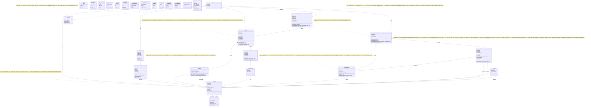

# Sơ đồ lớp chi tiết

```mermaid
classDiagram
    direction TB

    class DoiTuyen {
        +String maDoi
        +String tenDoi
        +String boMon
        +thongKeCaNhan(tv: ThanhVien) ThongKeCaNhan
    }

    class ThanhVien {
        +String maTV
        +String hoTen
        +String sdt
        +String email
        +VaiTro vaiTro
        +TrangThaiTV trangThai
        +String viTriThiDau
        +int soAo
        +Date ngayVaoDoi
        +capNhatLienLac(sdt: String, email: String) void
        +chuyenTrangThai(moi: TrangThaiTV) void
        +xemLichBieu() List~LichBieu~
    }

    class TinTuyenDung {
        +String maTin
        +String tieuDe
        +String yeuCau
        +int soLuongCan
        +Date hanNop
        +bool dangMo
        +dangTin() void
        +dongTin() void
    }

    class HoSoUngTuyen {
        +String maHoSo
        +String hoTen
        +String sdt
        +String email
        +String hoSoUrl
        +DateTime ngayNop
        +TrangThaiHoSo trangThai
        +String nhanXet
        +moiThu(hlv: ThanhVien) ThanhVien
        +tuChoi(lyDo: String) void
        +rutHoSo() void
    }

    class DanhGiaThuViec {
        +String maDG
        +Date ngayDanhGia
        +float diemChuyenMon
        +String nhanXet
        +KetQuaThuViec ketQua
        +chotKetQua() void
    }

    class QuyTacLap {
        +String maQuy
        +String tieuDe
        +LoaiLich loai
        +String diaDiem
        +List~int~ cacThu
        +Time gioBatDau
        +Time gioKetThuc
        +Date ngayBatDau
        +Date ngayKetThuc
        +taoCacBuoi() List~LichBieu~
        +suaTuBuoiNay(tu: LichBieu, gioMoi: Time, diaDiemMoi: String) void
        +huyTuBuoiNay(tu: LichBieu, lyDo: String) void
    }

    class LichBieu {
        +String maLich
        +String tieuDe
        +LoaiLich loai
        +TrangThaiLich trangThai
        +DateTime batDau
        +DateTime ketThuc
        +String diaDiem
        +bool daSuaRieng
        +String lyDoHuy
        +kiemTraTrung() bool
        +doiLich(batDau: DateTime, ketThuc: DateTime) void
        +huyLich(lyDo: String) void
        +danhDauHoanThanh() void
        +guiThongBao(loai: LoaiThongBao) void
    }

    class DiemDanh {
        +PhanHoiThamGia phanHoi
        +String lyDoXinNghi
        +TrangThaiDiemDanh trangThai
        +DateTime thoiGianGhiNhan
        +guiPhanHoi(ph: PhanHoiThamGia, lyDo: String) void
        +ghiNhan(tt: TrangThaiDiemDanh, nguoi: ThanhVien) void
    }

    class TranDau {
        +String maTran
        +String tenGiai
        +String doiThu
        +int diemDoiMinh
        +int diemDoiThu
        +KetQuaTran ketQua
        +chotDoiHinh(ds: List~ThanhVien~) void
        +ghiKetQua(diemMinh: int, diemDoi: int) void
    }

    class ThamGiaTranDau {
        +String viTri
        +bool laDaChinh
        +int phutThiDau
        +float diemDanhGia
        +String nhanXet
    }

    class ThongKeCaNhan {
        <<computed>>
        +float tyLeChuyenCan
        +int soTranThamGia
        +float tyLeThang
        +float diemDanhGiaTB
    }

    class Quy {
        +String maQuy
        +Decimal soDu
        +String nganHang
        +String taiKhoanNhan
        +kiemTraKhaNangChi(soTien: Decimal) bool
        +ghiThu(gd: GiaoDich) void
        +ghiChi(gd: GiaoDich) void
        +taoKhoanDongThang(ky: String, soTien: Decimal) List~KhoanDongQuy~
        +nhacThanhVienChuaDong(ky: String) int
    }

    class KhoanDongQuy {
        +String maKhoan
        +String ky
        +Decimal soTien
        +Date hanDong
        +TrangThaiKhoan trangThai
        +taoMaQR() String
        +guiYeuCauDuyet(nguoiGui: ThanhVien) GiaoDich
        +kiemTraQuaHan() bool
    }

    class GiaoDich {
        +String maGD
        +LoaiGD loai
        +String hangMuc
        +Decimal soTien
        +DateTime thoiGian
        +TrangThaiGD trangThai
        +String ghiChu
        +PhuongThucXacNhan phuongThucXacNhan
        +String maThamChieu
        +String lyDoTuChoi
        +DateTime thoiGianXuLy
        +duyet(nguoiDuyet: ThanhVien) void
        +tuChoi(nguoiDuyet: ThanhVien, lyDo: String) void
    }

    class ThongBao {
        +String maTB
        +LoaiThongBao loai
        +String noiDung
        +DateTime thoiGian
        +bool daDoc
    }

    class VaiTro {
        <<enumeration>>
        TUYEN_THU
        HUAN_LUYEN_VIEN
        THU_QUY
    }

    class TrangThaiTV {
        <<enumeration>>
        THU
        CHINH_THUC
        DA_LOAI
        ROI_DOI
    }

    class TrangThaiHoSo {
        <<enumeration>>
        DA_NOP
        DANG_XET
        MOI_THU
        TU_CHOI
        DA_RUT
    }

    class KetQuaThuViec {
        <<enumeration>>
        DAT
        KHONG_DAT
    }

    class LoaiLich {
        <<enumeration>>
        TAP
        HOP
        THI_DAU
    }

    class TrangThaiLich {
        <<enumeration>>
        DU_KIEN
        DA_DOI
        DA_HUY
        HOAN_THANH
    }

    class PhanHoiThamGia {
        <<enumeration>>
        CHUA_PHAN_HOI
        SE_THAM_GIA
        XIN_NGHI
    }

    class TrangThaiDiemDanh {
        <<enumeration>>
        CHUA_GHI_NHAN
        CO_MAT
        DI_MUON
        VANG_CO_PHEP
        VANG_KHONG_PHEP
    }

    class KetQuaTran {
        <<enumeration>>
        THANG
        HOA
        THUA
    }

    class LoaiGD {
        <<enumeration>>
        THU
        CHI
    }

    class TrangThaiGD {
        <<enumeration>>
        CHO_XU_LY
        THANH_CONG
        THAT_BAI
    }

    class TrangThaiKhoan {
        <<enumeration>>
        CHUA_DONG
        CHO_XU_LY
        DA_DONG
    }

    class PhuongThucXacNhan {
        <<enumeration>>
        THU_QUY
        NGAN_HANG_API
    }

    class LoaiThongBao {
        <<enumeration>>
        NHAC_QUY
        YEU_CAU_DUYET
        KET_QUA_DUYET
        LICH_MOI
        LICH_DOI
        LICH_HUY
        KET_QUA_HO_SO
    }

    %% The team is the ownership root for members, fund, sessions and recurrence rules
    DoiTuyen "1" *-- "0..*" ThanhVien : gom
    DoiTuyen "1" *-- "1" Quy : coQuy
    DoiTuyen "1" *-- "0..*" TinTuyenDung : dang
    DoiTuyen "1" *-- "0..*" LichBieu : lap
    DoiTuyen "1" *-- "0..*" QuyTacLap : datQuyTac
    DoiTuyen ..> ThongKeCaNhan : tinh

    %% Recruitment flow (still undecided): application -> trial -> official member
    TinTuyenDung "1" *-- "0..*" HoSoUngTuyen : nhan
    HoSoUngTuyen "1" --> "0..1" ThanhVien : moiThuThanh
    ThanhVien "1" *-- "0..*" DanhGiaThuViec : duocDanhGia
    DanhGiaThuViec "0..*" --> "1" ThanhVien : nguoiDanhGia

    %% Schedule: a rule generates many sessions, a one-off session has no rule
    QuyTacLap "0..1" o-- "1..*" LichBieu : sinhRa

    %% Attendance is recorded per session and per member
    LichBieu "1" *-- "0..*" DiemDanh : ghiNhan
    DiemDanh "0..*" --> "1" ThanhVien : cua
    DiemDanh "0..*" --> "0..1" ThanhVien : nguoiGhiNhan

    %% A match is the detail record of exactly one session of type THI_DAU
    LichBieu "1" *-- "0..1" TranDau : chiTietTran
    TranDau "1" *-- "0..*" ThamGiaTranDau : doiHinh
    ThamGiaTranDau "0..*" --> "1" ThanhVien : cua

    %% Fund: transactions belong to the fund, dues are generated per member and period
    Quy "1" *-- "0..*" GiaoDich : ghiNhan
    Quy "1" *-- "0..*" KhoanDongQuy : phatSinh
    KhoanDongQuy "0..*" --> "1" ThanhVien : phaiDong

    %% One due can have several payment attempts (failed ones plus at most one successful)
    GiaoDich "0..*" --> "0..1" KhoanDongQuy : thanhToanCho
    GiaoDich "0..*" --> "1" ThanhVien : nguoiThucHien
    GiaoDich "0..*" --> "0..1" ThanhVien : nguoiDuyet

    %% Notifications
    ThongBao "0..*" --> "1" ThanhVien : nguoiNhan

    %% Business rules
    note for ThanhVien "Flow: HoSoUngTuyen (tuyen) -> THU -> CHINH_THUC -> ThamGiaTranDau (thi dau)\nDA_LOAI: khong dat thu. ROI_DOI: roi doi.\nviTriThiDau, soAo chi co y nghia voi TUYEN_THU.\nChi thanh vien CHINH_THUC moi phai dong quy."

    note for QuyTacLap "Chi lap theo tuan, chi cho loai TAP va HOP. cacThu theo ISO: 1 = Thu hai, 7 = Chu nhat.\nToi da 50 buoi moi chuoi.\nSua/huy chi co 2 pham vi: chi buoi nay, hoac tu buoi nay tro di.\nChi tac dong len buoi DU_KIEN hoac DA_DOI, khong dung buoi HOAN_THANH.\nSua hang loat bo qua buoi daSuaRieng == true.\nHuy hang loat ap dung cho moi buoi tu buoi duoc chon tro di."

    note for LichBieu "RULE: TranDau chi gan duoc voi LichBieu loai THI_DAU.\nTrang thai: DU_KIEN / DA_DOI -> HOAN_THANH hoac DA_HUY, khong di nguoc lai.\nghiKetQua() chi thuc thi khi trangThai == HOAN_THANH.\nDoi/huy lich phai gui thong bao LICH_DOI / LICH_HUY.\nBuoi da co phan hoi hoac diem danh chi duoc huy, khong duoc xoa.\nkiemTraTrung(): trung gio hoac dia diem trong pham vi doi."

    note for DiemDanh "UNIQUE (LichBieu, ThanhVien).\nSinh san khi tao lich: phanHoi = CHUA_PHAN_HOI, trangThai = CHUA_GHI_NHAN.\nDoi tuong mac dinh: thanh vien THU va CHINH_THUC (chua chot).\nguiPhanHoi: thanh vien tu thao tac truoc buoi. ghiNhan: HLV thao tac sau buoi."

    note for ThongKeCaNhan "tyLeChuyenCan = (CO_MAT + DI_MUON) / (CO_MAT + DI_MUON + VANG_KHONG_PHEP)\nVANG_CO_PHEP khong tinh vao mau so. Chi tinh buoi HOAN_THANH.\nsoTranThamGia, tyLeThang: chi tinh tran cua buoi HOAN_THANH."

    note for Quy "INVARIANT: soDu >= 0\nsoDu chi thay doi khi giao dich chuyen sang THANH_CONG.\nghiChi() nem loi neu kiemTraKhaNangChi() == false."

    note for KhoanDongQuy "UNIQUE (ThanhVien, ky). Chi sinh cho thanh vien CHINH_THUC.\nCHUA_DONG -> CHO_XU_LY -> DA_DONG. Bi tu choi: CHO_XU_LY -> CHUA_DONG.\nguiYeuCauDuyet() chi chay khi trangThai == CHUA_DONG, tao GiaoDich CHO_XU_LY.\nQua han khong luu: kiemTraQuaHan() = hanDong < hom nay va trangThai != DA_DONG.\nMa QR chua: soTien, nganHang va taiKhoanNhan cua Quy, noi dung chuyen khoan = maKhoan."

    note for GiaoDich "Giao dich THU gan voi KhoanDongQuy: tao khi thanh vien bam Yeu cau duyet.\nTrang thai: CHO_XU_LY -> THANH_CONG hoac THAT_BAI. Trang thai cuoi khong doi.\nduyet(): trong 1 transaction: GD -> THANH_CONG, Khoan -> DA_DONG, soDu += soTien.\ntuChoi(): GD -> THAT_BAI, Khoan -> CHUA_DONG, luu lyDoTuChoi. Thanh vien tao GD moi de thu lai.\nMot khoan co toi da 1 GD CHO_XU_LY va toi da 1 GD THANH_CONG.\nChi VaiTro THU_QUY moi duyet hoac tu choi.\nGiao dich CHI do thu quy tao, ghi thang THANH_CONG, khong qua buoc duyet.\nmaThamChieu: ma giao dich ngan hang, UNIQUE neu co, chong ghi nhan 2 lan.\nNGAN_HANG_API goi lai duyet() / tuChoi() giong thu quy, khi do nguoiDuyet de trong."
```